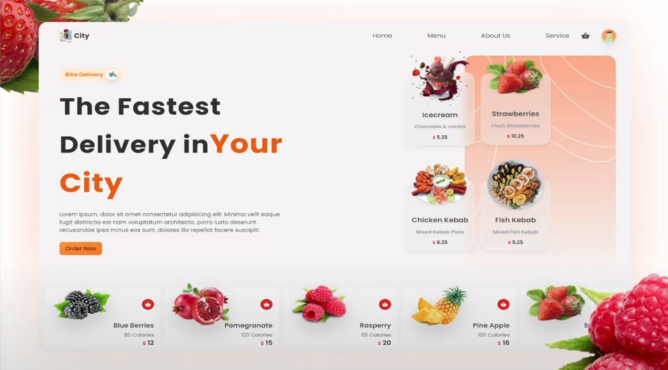

> FullStack food delivery application using reactjs
> 

> Packages used
> |Name|Link|
> |----|-----|
> |ReactJs|[React](https://reactjs.org/)|
> |TailwindCSS|[TailwindCSS](https://tailwindcss.com/)|
> |Firebase Functions|[Functions](https://firebase.google.com/docs/functions)|
> |Express|[Express](https://expressjs.com/)|
> |React Router DOM|[ReactRouterDom](https://reactrouter.com/en/main)|
> |Framer Motion|[FramerMotion](https://www.framer.com/motion/)|
> |React Icons|[ReactIcons](https://react-icons.github.io/react-icons/)|
